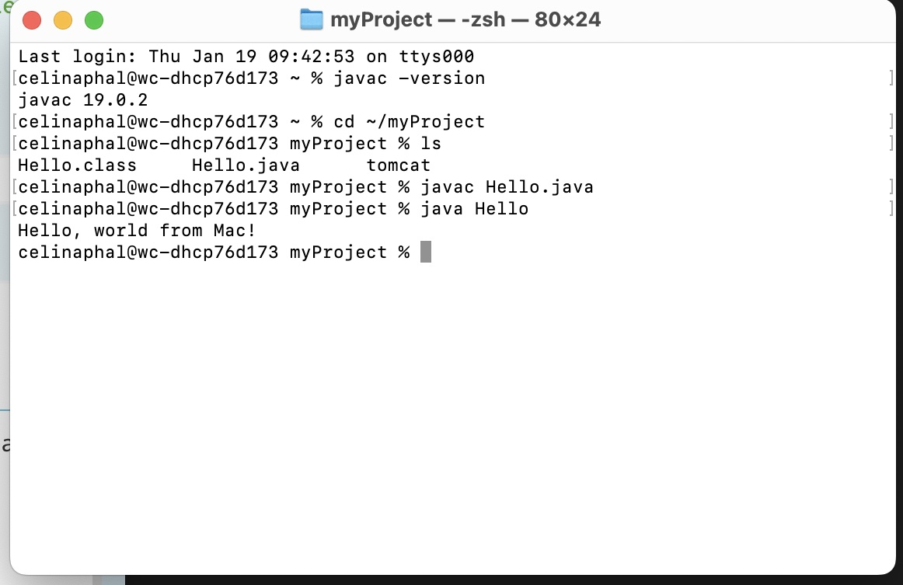
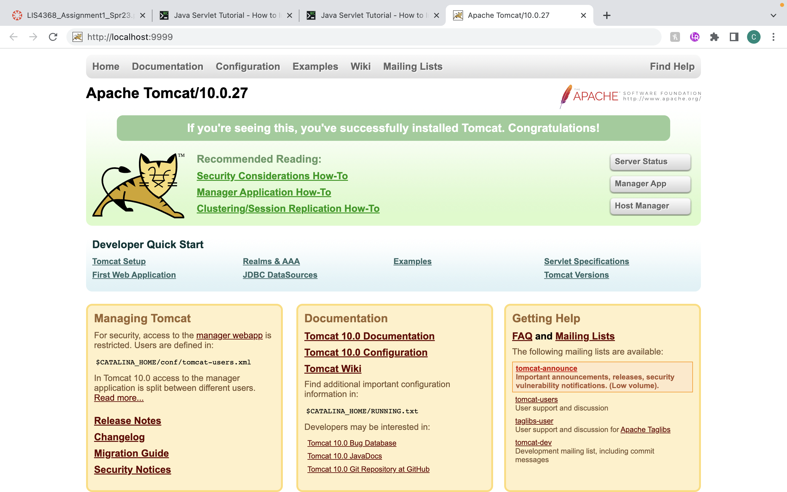
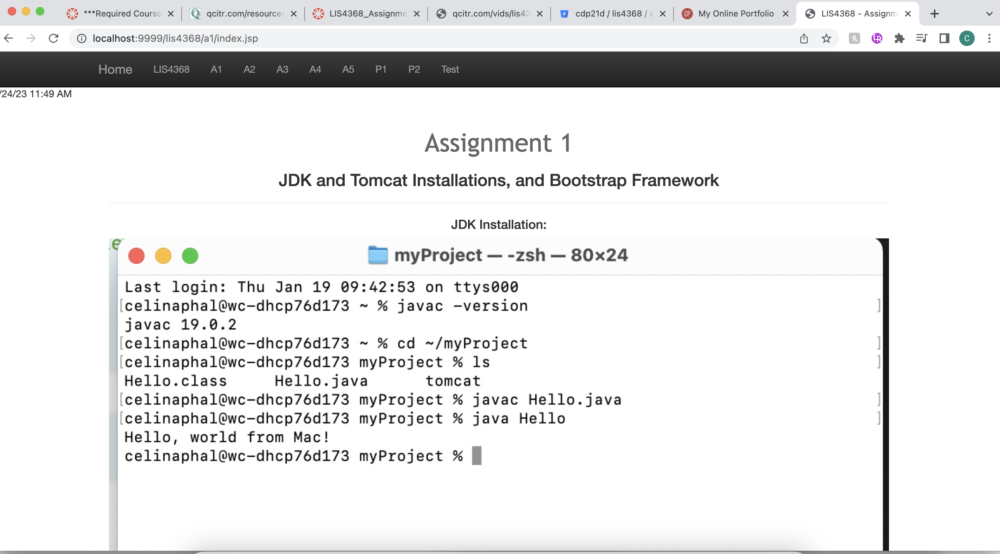

LIS4368: Advanced Web App Development

## Celina Phal

### Assignment 1 Requirements:

*Three Parts:*

1. Distributed Version Control with Git and Bitbucket
2. Java/JSP/Servlet Development Installation
3. Chapter Questions (Chs 1-4)

#### README.md file should include the following items:

* Screenshot of running java Hello (#1 above):
* Screenshot of running http://localhost:9999 (#2 above, Step #4(b) in tutorial);
* git commands w/ short descriptions:
* Bitbucket repo links: a) this assignment and b) the completed tutorial above (bitbucketstationlocations):

> This is a blockquote.
> 
> This is the second paragraph in the blockquote.
>
> #### Git commands w/short descriptions:

1. git init - creates a new Git repository.
2. git status - displays the state of the directory.
3. git add - adds a change in the working directory.
4. git commit - creates a snapshot of the repo at that time.
5. git push - uploads local repository content to a remote repository.
6. git pull - fetch and downloads content from a remote repository to update the local repository.
7. git clone - make a clone of an existing repo in a new directory.

#### Assignment Screenshots:

*Screenshot of running java Hello*:

*Screenshot of running http://localhost:9999*:

*Screenshot of a1/index.jsp*:

#### Tutorial Links:

*Bitbucket Tutorial - Station Locations:*
[A1 Bitbucket Station Locations Tutorial Link](https://bitbucket.org/cdp21d/bitbucketstationlocations/src/master/ "Bitbucket Station Locations")

*Tutorial: Request to update a teammate's repository:*
[A1 My Team Quotes Tutorial Link](https://bitbucket.org/username/myteamquotes/ "My Team Quotes Tutorial")