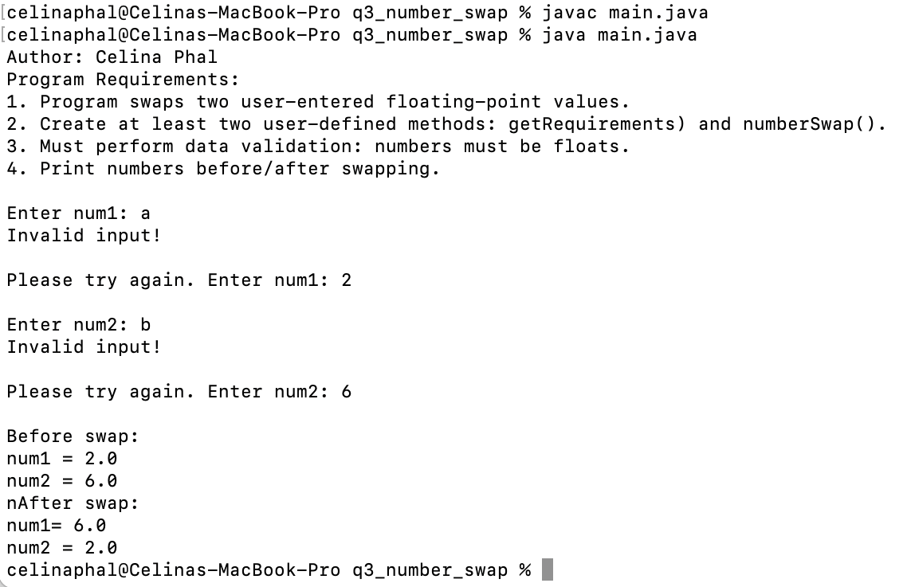

LIS4368: Advanced Web App Development

## Celina Phal

### Assignment 2 Requirements:

1. Install MySql Workbench.
2. Java/JSP/Servlet Development Installation
3. Complete skillsets 1-3.

#### README.md file should include the following items:

* Assessment links
* Screenshots (3 minimum): 1) querybook.html, 2) the query results, and 3) a screenshot of a2/index.jsp file

#### Assessment Links and Screenshots:

*Screenshot of running [http://localhost:9999/hello](http://localhost:9999/hello)*:
    

*Screenshot of running [http://localhost:9999/hello/HelloHome.html](http://localhost:9999/hello/HelloHome.html)*:
    

*Screenshot of running [http://localhost:9999/hello/sayhello](http://localhost:9999/hello/sayhello)*:
    

*Screenshot of running [http://localhost:9999/hello/querybook.html](http://localhost:9999/hello/querybook.html)*:
    

#### Query Results:

#### a2/index

### Skillsets

| *Screenshot of Skillset 1*      | *Screenshot of Skillset 2*: | *Screenshot of Skillset 3*:     |
| :----:       |    :----:   |          :----: |
|    |  |  |
