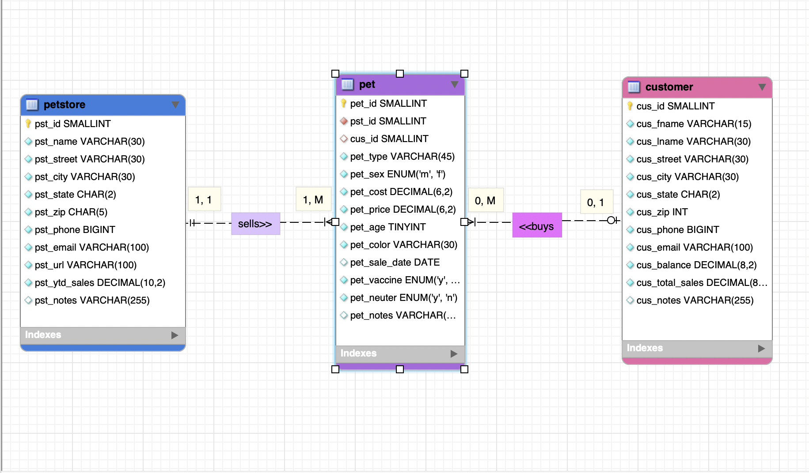
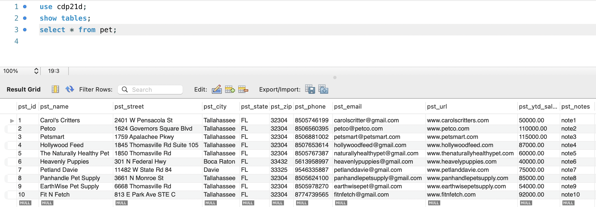
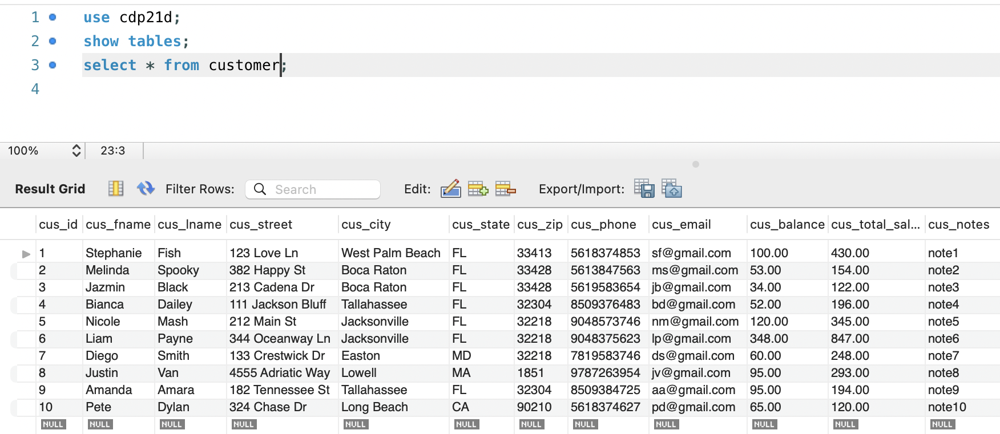
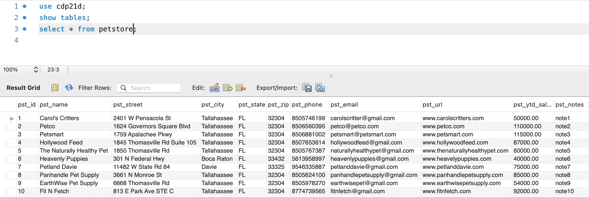
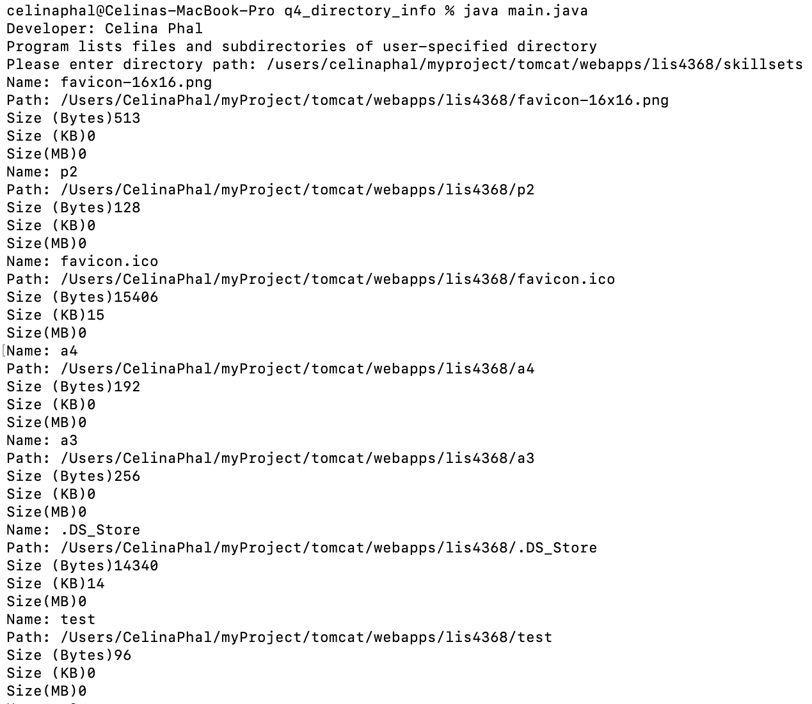
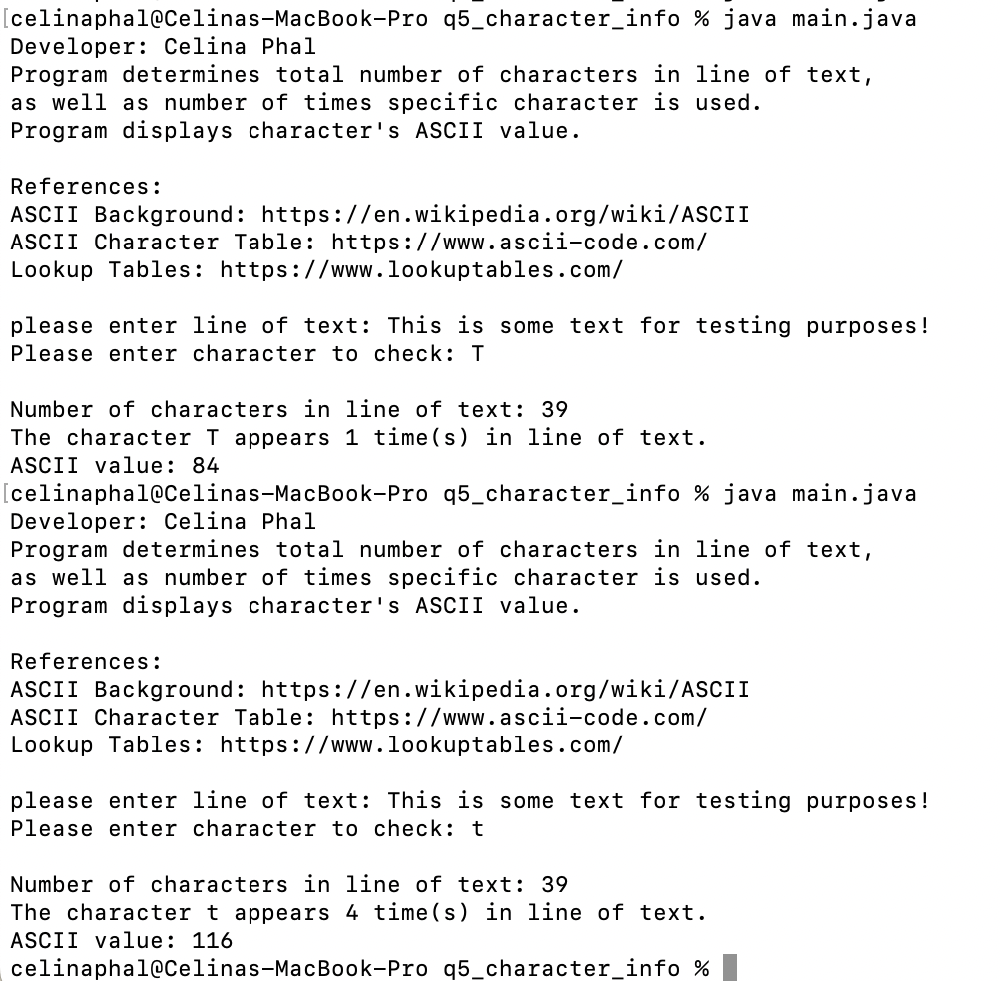
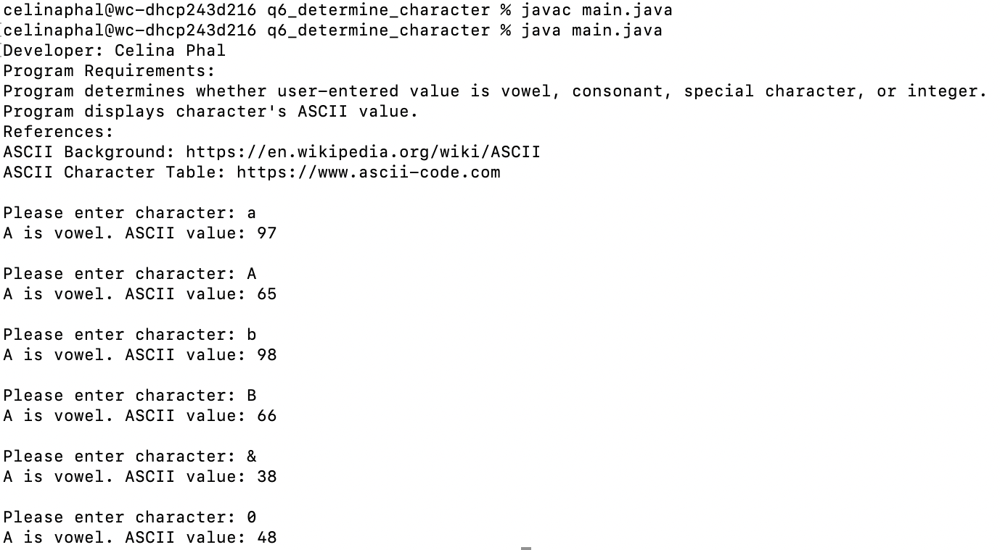

# LIS4381: Mobile App Development

## Celina Phal

#### Assignment 3 Requirements

1. Create MySQL Database based on given instructions.
2. Provide screenshots of completed ERD.
3. Screenshots of skillsets 4-6.

#### Assignment Screenshot and Links: 
 
*Screenshot A3 ERD*: 
 
 
 
*A3 docs: a3.mwb and a3.sql*: 
 
[A3 MWB File](docs/a3.mwb "A3 ERD in .mwb format") 
 
[A3 SQL File](docs/a3.sql "A3 SQL Script") 
  

Pet Table:

Customer Table:

Petstore Table:

| *Screenshot of Skillset 4*      | *Screenshot of Skillset 5*: | *Screenshot of Skillset 6*:     |
| :----:       |    :----:   |          :----: |
|    |  |  |
