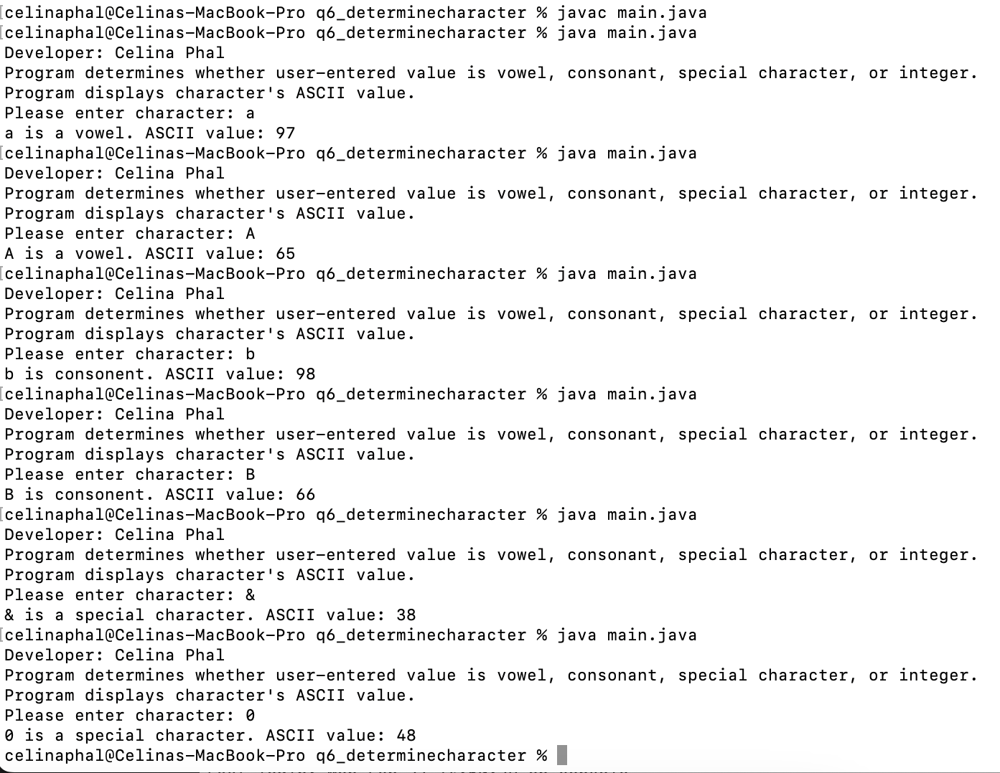

# LIS4381: Mobile App Development

## Celina Phal

#### Assignment 3 Requirements

1. Create MySQL Database based on given instructions.
2. Provide screenshots of completed ERD.
3. Screenshots of skillsets 4-6.

#### Screenshot of ERD:

#### Screenshot of 10 Records from each table:
Pet Table:

Customer Table:

Petstore Table:

Links:
[a3.mwb](docs/a3.mwb "a3.mwb")

[a3.sql](docs/A3.sql "a3.sql")

| *Screenshot of Skillset 4*      | *Screenshot of Skillset 5*: | *Screenshot of Skillset 6*:     |
| :----:       |    :----:   |          :----: |
|    |  |  |
