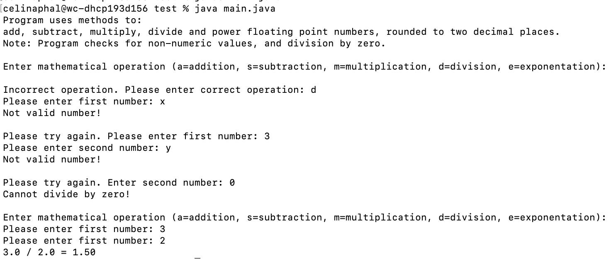
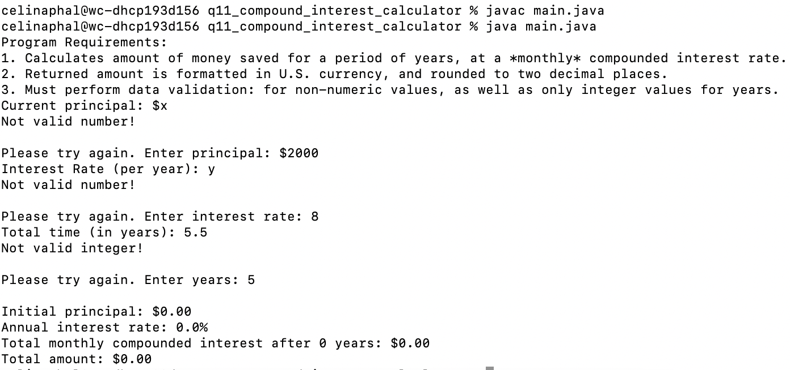
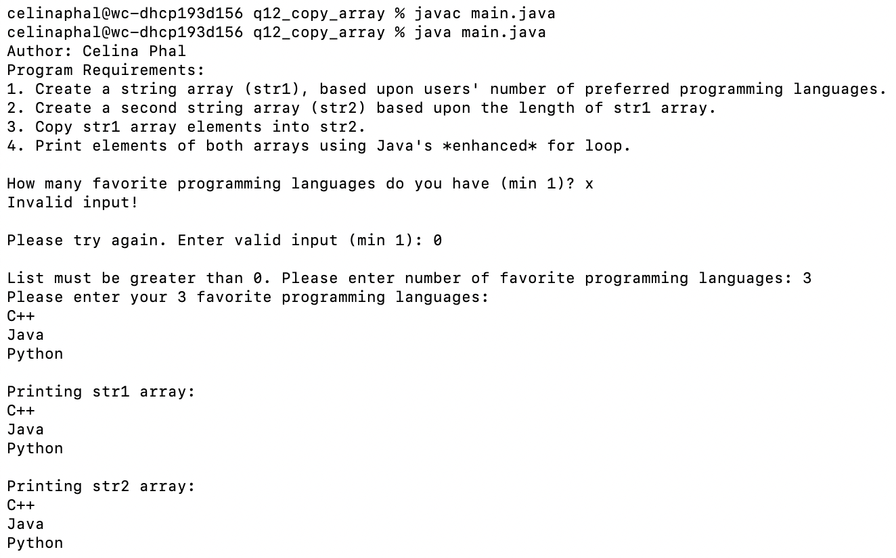

# LIS4381: Mobile App Development

## Celina Phal

#### Assignment 4 Requirements

    - Compile given class and servlet files. 
    - Screenshots of skillsets 10-12.
    - Extra: Provide server-side validation identical to client-side validation requirements. 

#### Assignment Screenshot and Links: 

| *Screenshot of Skillset 10*      | *Screenshot of Skillset 11*: | *Screenshot of Skillset 12*:     |
| :----:       |    :----:   |          :----: |
|  |  |  |
