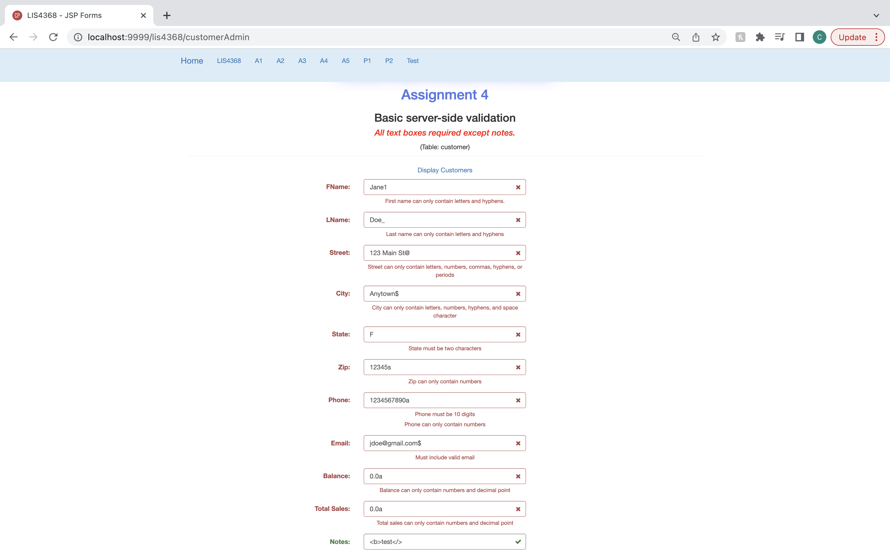

# LIS4381: Mobile App Development

## Celina Phal

#### Assignment 4 Requirements

1. Compile given class and servlet files.
2. Provide screenshot of passed validation form.
3. Provide screenshot of failed validation form.
4. Screenshot of thanks.jsp page.
5. Screenshots of skillsets 10-12.

#### Assignment Screenshot and Links: 
Passed Validation:

Failed Validation:

Thank You Page:

| *Screenshot of Skillset 10*      | *Screenshot of Skillset 11*: | *Screenshot of Skillset 12*:     |
| :----:       |    :----:   |          :----: |
|  |  |  |
