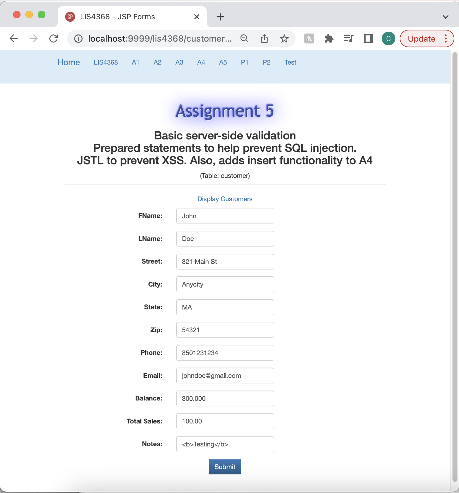
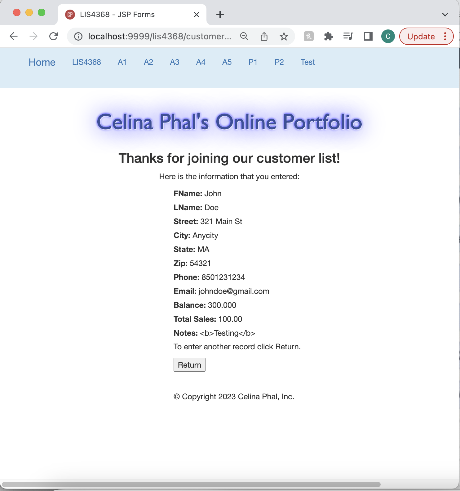
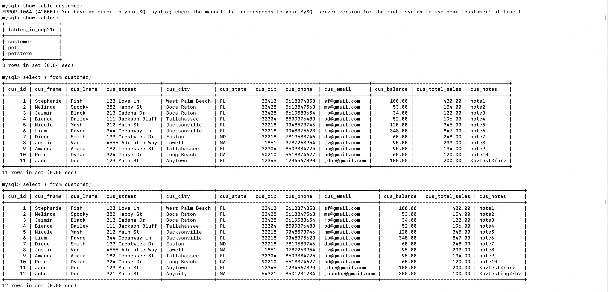
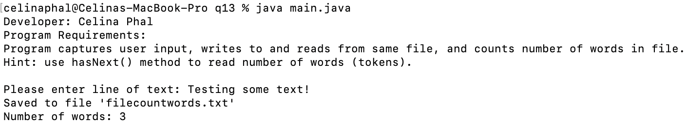
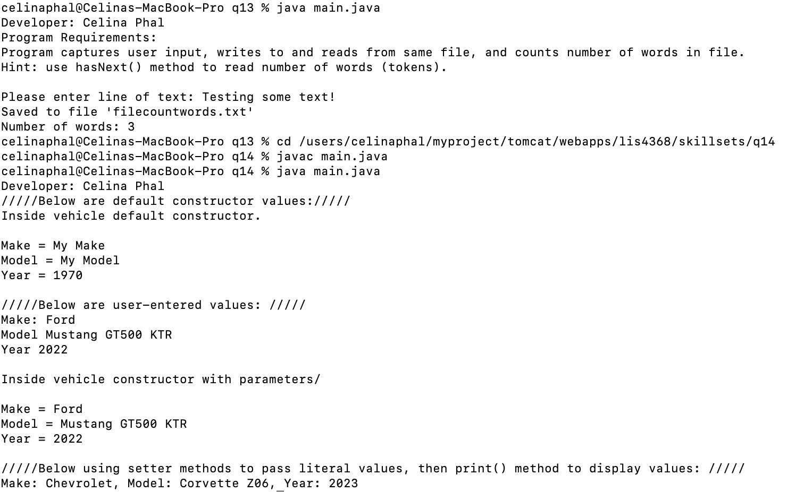
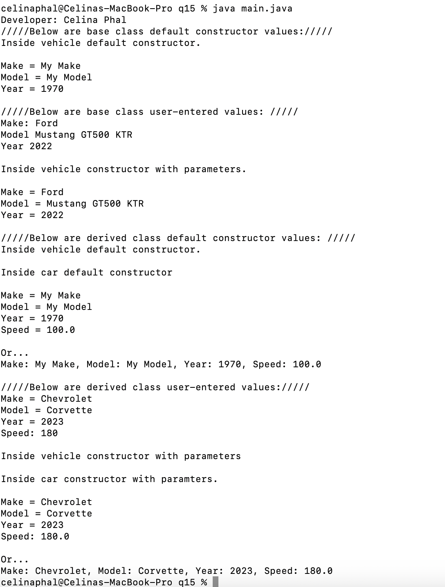

# LIS4368 - Web Applications Development

## Celina Phal

#### Assignment 5 Requirements

1. Add onto assignment 4 customerform.jsp to add customers to database. 
2. Provide screenshot of valid user form entry.
3. Provide screenshot of passed validation.
4. Provide screenshots of updated database.
5. Screenshots of skillsets 13-15.

| *Valid User Form Entry (customerform.jsp)*      | *Passed Validation (thanks.jsp)*: | 
| :----:       |    :----:   |
|    |  |

### Associated Database Entry

| *Screenshot of Skillset 13*      | *Screenshot of Skillset 14*: | *Screenshot of Skillset 15*:     |
| :----:       |    :----:   |          :----: |
|    |  |  |
