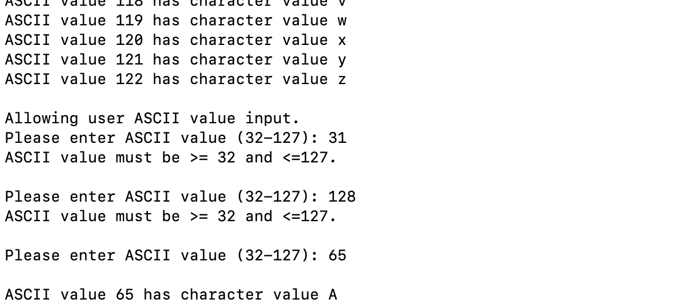

LIS4368: Advanced Web App Development

## Celina Phal

### Project 1 Requirements:

1. Develop and test jQuery validations. 
2. Provide screenshot of failed validation.
3. Provide screenshot of passed validation.
4. Skillsets 7-9.

#### LIS4368 Portal (Main/Splash Page):

#### Failed Validation

#### Passed Validation

#### Skillsets: 

*Skillset 7*

*Skillset 8*

*Skillset 9*

