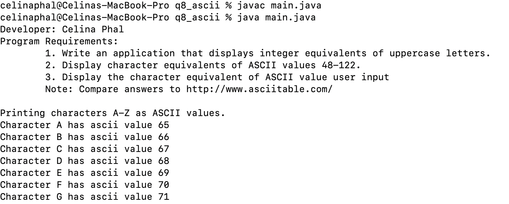

LIS4368: Advanced Web App Development

## Celina Phal

### Project 1 Requirements:

1. Develop and test jQuery validations. 
2. Provide screenshot of failed validation.
3. Provide screenshot of passed validation.
4. Skillsets 7-9.

#### LIS4368 Portal (Main/Splash Page):

#### Failed Validation

#### Passed Validation

| *Screenshot of Skillset 7*      | *Screenshot of Skillset 8*: | *Screenshot of Skillset 9*:     |
| :----:       |    :----:   |          :----: |
|    |   |
