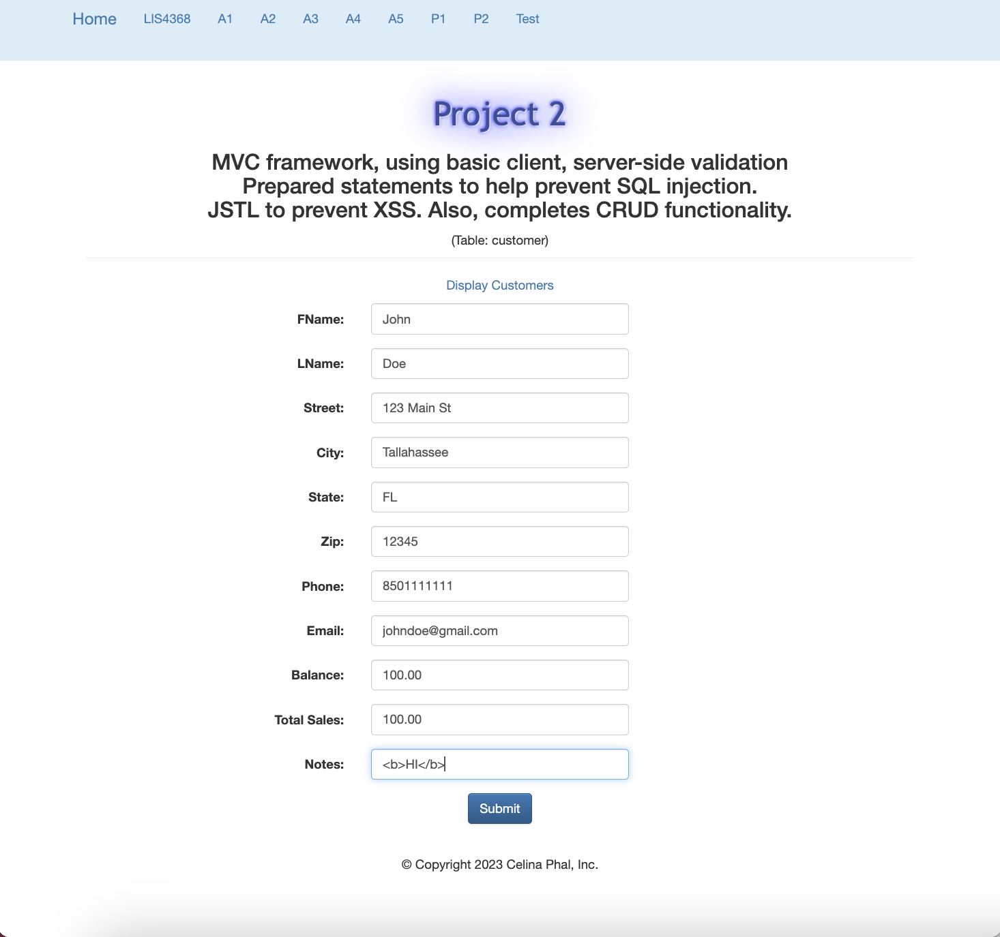
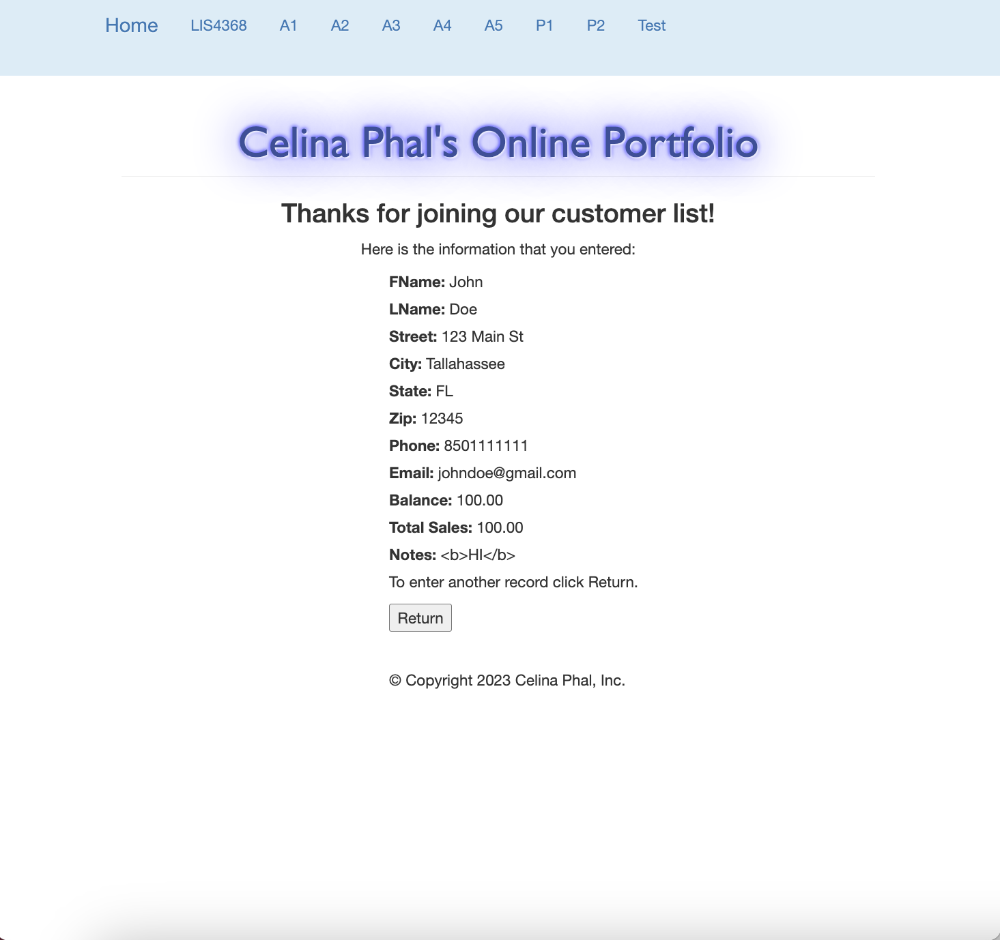
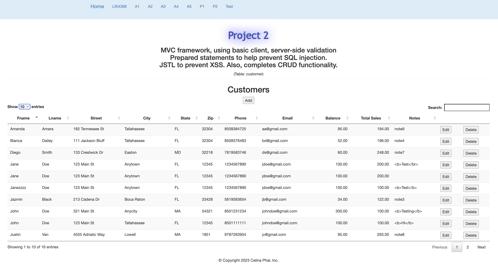
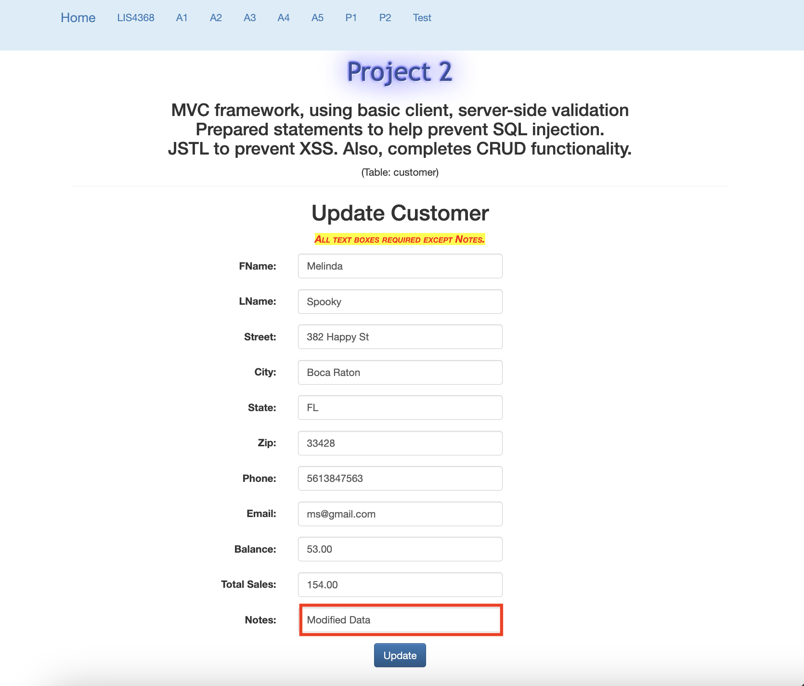
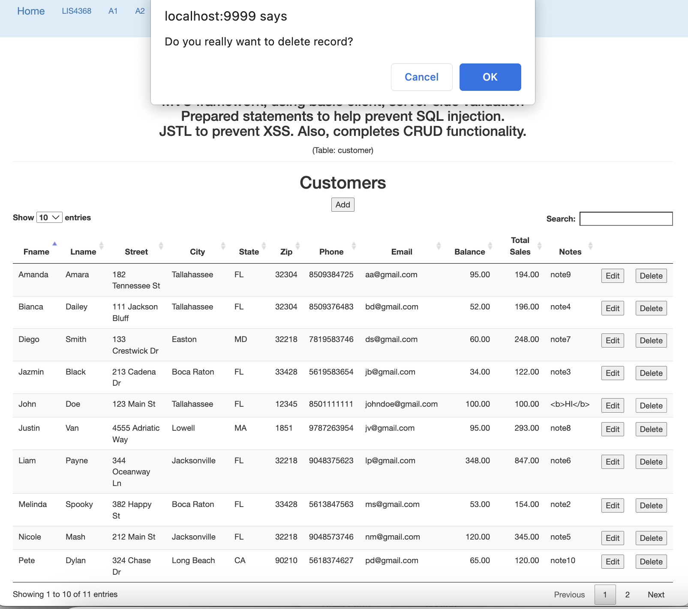
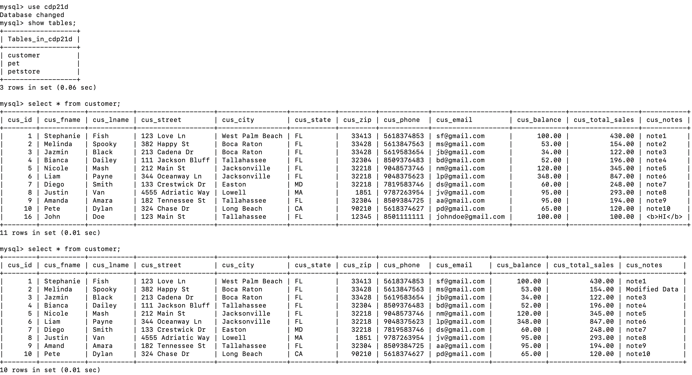

# LIS4368 - Web Applications Development

## Celina Phal

#### Project 2 Requirements

1. Add onto assignment 5 to complete CRUD functionality. 
2. Provide screenshot of valid user form entry.
3. Provide screenshot of passed validation.
4. Provide screenshot of modified data.
5. Provide screenshot of delete warning.
5. Provide screenshots of updated database.

| *Valid User Form Entry (customerform.jsp)*      | *Passed Validation (thanks.jsp)*: | 
| :----:       |    :----:   |
|    |  |

### Display Data (customers.jsp)

| *Modify Form (modify.jsp)*      | *Modified Data (customers.jsp)*: | 
| :----:       |    :----:   |
|    |  |

| *Delete Warning (customers.jsp)*      | *Associated Database Changes (Select, Insert, Update, Delete*: | 
| :----:       |    :----:   |
|    |  |
